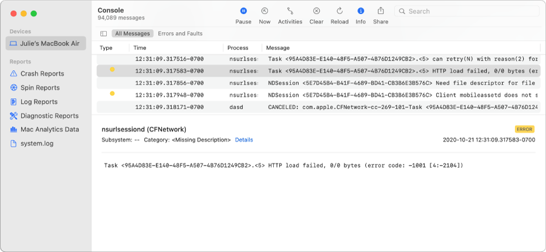

# OSLog

A minimal wrapper around Apple's [Unified Logging
System](https://developer.apple.com/documentation/os/logging). On macOS, this allows you
to capture telemetry from your Rust programs for debugging and performance
analysis.

## Debugging

For debugging, the telemetry sent to the macOS Logging system is available in
the [Console App](https://support.apple.com/guide/console/welcome/mac).




By default support for the [log](https://docs.rs/log) crate is provided, but if
you would prefer just to use the lower level bindings you can disable the
default `logger` feature.

When making use of targets (`info!(target: "t", "m");`), you should be aware
that a new log is allocated and stored in a map for the lifetime of the program.
I expect log allocations are extremely small, but haven't attempted to verify
it.

# Example

```rust
fn main() {
    OSLogger::new("com.example.test")
        .with_level(LevelFilter::Debug)
        .with_category("Settings", LevelFilter::Trace)
        .with_category("Parsing", LevelFilter::Info)
        .init()
        .unwrap();

    // Maps to OS_LOG_TYPE_DEBUG
    trace!(target: "Settings", "Trace message to the `Settings` category");

    // Maps to OS_LOG_TYPE_INFO
    debug!("Debug");

    // Maps to OS_LOG_TYPE_DEFAULT
    info!(target: "Parsing", "Info");

    // Maps to OS_LOG_TYPE_ERROR
    warn!("Warn");

    // Maps to OS_LOG_TYPE_FAULT
    error!("Error");
}
```


## Performance analysis

For performance analysis, you need to profile your program using [Xcode
Instruments]. This can be done quite easily with the [cargo-instruments]
crate.


# Missing features

* Activities
* Tracing
* Native support for line numbers and file names.

[cargo-instruments]: https://crates.io/crates/cargo-instruments
[Xcode Instruments]: https://developer.apple.com/library/archive/documentation/ToolsLanguages/Conceptual/Xcode_Overview/MeasuringPerformance.html
